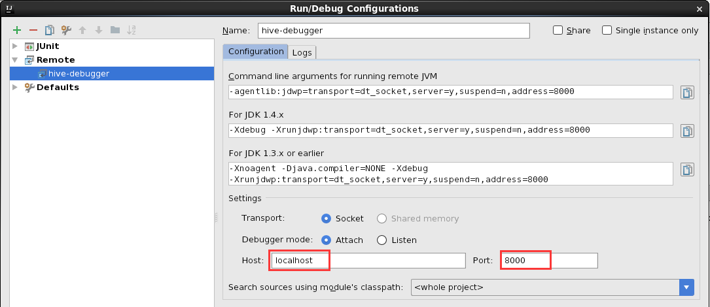

## 1 整体流程
本文主要介绍hive源码解析调试的本地环境搭建过程。本次采用linux作为调试环境，因为在linux上搭建运行hadoop、hive都比较容易操作。首先，hive构建在hadoop上，要想调试hive源码，需要提前搭建hadoop环境，可以搭建一个伪分布式的hadoop环境。其次，编译hive源码，开启debug模式。最后，将hive源码导入IntelliJ中，连接debug监听的端口，输入hql，就可以调试hive源码了。

## 2 环境准备
### 2.1 hadoop环境搭建
参照文章《[hadoop之伪分布式搭建](https://qingzhongli.com/hadoop-pseudo-distributed-operation/)》。
### 2.2 IntelliJ安装
```
wget https://download.jetbrains.com/idea/ideaIU-2017.2.6-no-jdk.tar.gz

tar -zxvf ideaIU-2017.2.6-no-jdk.tar.gz -C /usr/local/

/usr/local/idea-IU-172.4574.11/bin/idea.sh
```
安装完成后，需要安装ANTLR插件，因为hive的部分源码是ANTLR语言。
### 2.3 MySQL安装
参照：[Installing MySQL on Linux](https://dev.mysql.com/doc/refman/8.0/en/linux-installation.html)
### 2.4 Maven安装
安装比较简单，参照：[Installing Apache Maven](https://maven.apache.org/install.html)

## 3 搭建具体步骤

### 3.1 hive源码下载
本次选作解析调试用的hive源码版本为2.3.3
```sh
# 下载
wget http://mirrors.hust.edu.cn/apache/hive/hive-2.3.3/apache-hive-2.3.3-src.tar.gz
# 解压
tar zxvf apache-hive-2.3.3-src.tar.gz
```
### 3.2 hive源码编译
```sh
mvn clean package -DskipTests -Pdist
```
hive.2.x版本不再支持hadoop.1.x，所以编译时不再区分hadoop.1.x与hadoop.2.x，编译命令参数中不再需要附带`-Dhadoop-2`或者`-Dhadoop-1`，详细请参照：[Building Hive from Source](https://cwiki.apache.org/confluence/display/Hive/GettingStarted#GettingStarted-BuildingHivefromSource)。编译过程中需要下载大量jar包，下载出错的jar包删除重新下载即可。编译后文件位于packaging下，如下：
```sh
[root@d1 apache-hive-2.3.3-src]# pwd
/root/apache-hive-2.3.3-src
[root@d1 apache-hive-2.3.3-src]# ls packaging
hive-packaging.iml  pom.xml  src  target
[root@d1 apache-hive-2.3.3-src]# ls packaging/target
antrun                 apache-hive-2.3.3-bin.tar.gz  apache-hive-2.3.3-src.tar.gz  maven-shared-archive-resources  tmp
apache-hive-2.3.3-bin  apache-hive-2.3.3-jdbc.jar    archive-tmp                   testconf                        warehouse
[root@d1 apache-hive-2.3.3-src]#
```

### 4 hive配置
#### 4.1 hive元数据配置
Hive默认将元数据存储在Derby数据库中，但Derby只能允许一个会话连接，只适合简单的测试。在实际的生产环境中，一般选择MySQL作为hive存储元数据的数据库。
本次选用的是MySQL，使用root账户登录mysql，创建用于存储元数据的数据库实例、用户名、密码，本次示例中统一使用hive作为数据库实例、用户名、密码，使用如下命令创建：
```sql
mysql> create database hive default character set utf8;
mysql> grant all on hive.* TO 'hive'@'%' IDENTIFIED BY 'hive';
```
#### 4.2 hive配置文件配置
```xml
<property>
    <name>system:java.io.tmpdir</name>
    <value>/root/apache-hive-2.3.3-src/packaging/target/apache-hive-2.3.3-bin/apache-hive-2.3.3-bin/tmp</value>
</property>
<property>
    <name>system:user.name</name>
    <value>hive</value>
</property>
<property>
    <name>javax.jdo.option.ConnectionURL</name>
    <value>jdbc:mysql://localhost:3306/hive?createDatabaseIfNotExist=true&amp;useSSL=false</value>
</property>
<property>
    <name>javax.jdo.option.ConnectionDriverName</name>
    <value>com.mysql.jdbc.Driver</value>
</property>
<property>
    <name>javax.jdo.option.ConnectionUserName</name>
    <value>hive</value>
</property>
<property>
    <name>javax.jdo.option.ConnectionPassword</name>
    <value>hive</value>
</property>
```
注意事项：
* 需要上传与所安装的mysql的版本兼容连接驱动，本次mysql使用5.7.19，驱动为选的是[mysql-connector-java-5.1.38.jar](http://central.maven.org/maven2/mysql/mysql-connector-java/5.1.38/mysql-connector-java-5.1.38.jar)，上传放在到HIVE_HOME/lib下即可。如下所示：
```sh
$ packaging/target/apache-hive-2.3.3-bin/apache-hive-2.3.3-bin/lib/mysql-connector-java-5.1.38.jar
```

* 查看一下mysql是否启用SSL，使用如下命令：
```
mysql> show global variables like '%ssl%';
+---------------+----------+
| Variable_name | Value    |
+---------------+----------+
| have_openssl  | DISABLED |
| have_ssl      | DISABLED |
| ssl_ca        |          |
| ssl_capath    |          |
| ssl_cert      |          |
| ssl_cipher    |          |
| ssl_crl       |          |
| ssl_crlpath   |          |
| ssl_key       |          |
+---------------+----------+
9 rows in set (0.02 sec)
```
如果mysql的SSL没有开启的话，连接字符串需要追加useSSL=false，如下：
```
jdbc:mysql://localhost:3306/hive?createDatabaseIfNotExist=true&amp;useSSL=false
```

#### 4.3 hive所需路径创建
```sh
$ hadoop fs -mkdir       /tmp
$ hadoop fs -mkdir       /user/hive/warehouse
$ hadoop fs -chmod g+w   /tmp
$ hadoop fs -chmod g+w   /user/hive/warehouse
```
#### 4.4 hive元数据初始化
```sh
$ schematool -dbType mysql -initSchema
```
从hive2.1开始需要使用元数据工具来初始化其元数据，参照：[Running HiveServer2 and Beeline](https://cwiki.apache.org/confluence/display/Hive/GettingStarted#GettingStarted-RunningHiveServer2andBeeline.1)
，本次操作记录如下：
```
[root@d1 apache-hive-2.3.3-bin]# bin/schematool -dbType mysql -info
......
Metastore connection URL:        jdbc:mysql://localhost:3306/hive?createDatabaseIfNotExist=true&useSSL=false
Metastore Connection Driver :    com.mysql.jdbc.Driver
Metastore connection User:       hive
org.apache.hadoop.hive.metastore.HiveMetaException: Failed to get schema version, Cause:Table 'hive.VERSION' doesn't exist
Use --verbose for detailed stacktrace.
*** schemaTool failed ***
[root@d1 apache-hive-2.3.3-bin]# bin/schematool -dbType mysql -initSchema
......
Metastore connection URL:        jdbc:mysql://localhost:3306/hive?createDatabaseIfNotExist=true&useSSL=false
Metastore Connection Driver :    com.mysql.jdbc.Driver
Metastore connection User:       hive
Starting metastore schema initialization to 2.3.0
Initialization script hive-schema-2.3.0.mysql.sql
Initialization script completed
schemaTool completed
[root@d1 apache-hive-2.3.3-bin]# bin/schematool -dbType mysql -info      
......
Metastore connection URL:        jdbc:mysql://localhost:3306/hive?createDatabaseIfNotExist=true&useSSL=false
Metastore Connection Driver :    com.mysql.jdbc.Driver
Metastore connection User:       hive
Hive distribution version:       2.3.0
Metastore schema version:        2.3.0
schemaTool completed
[root@d1 apache-hive-2.3.3-bin]#
```
#### 4.5 hive cli 启动测试
```sh
# 启动hadoop
[root@d1 hadoop-2.9.2]# sbin/start-dfs.sh
[root@d1 hadoop-2.9.2]# sbin/start-yarn.sh

# 确认是否正确启动
[root@d1 hadoop-2.9.2]# jps -l
3604 org.apache.hadoop.yarn.server.resourcemanager.ResourceManager
2933 org.apache.hadoop.hdfs.server.namenode.NameNode
3429 org.apache.hadoop.hdfs.server.namenode.SecondaryNameNode
3990 sun.tools.jps.Jps
3799 org.apache.hadoop.yarn.server.nodemanager.NodeManager
3129 org.apache.hadoop.hdfs.server.datanode.DataNode
[root@d1 hadoop-2.9.2]#

# hive cli 启动测试
[root@d1 apache-hive-2.3.3-bin]# bin/hive
......
hive> show databases;
OK
default
Time taken: 8.455 seconds, Fetched: 1 row(s)
hive>
```
#### 4.6 hiveserver2 的使用
>HiveServer2 (HS2) is a server interface that enables remote clients to execute queries against Hive and retrieve the results (a more detailed intro [here](https://cwiki.apache.org/confluence/display/Hive/HiveServer2+Overview)). The current implementation, based on Thrift RPC, is an improved version of HiveServer and supports multi-client concurrency and authentication. It is designed to provide better support for open API clients like JDBC and ODBC.

启动hiveserver2

```
$HIVE_HOME/bin/hiveserver2 # 或者 $HIVE_HOME/bin/hive --service hiveserver2
```

使用beeline连接

本例中没有使用用户名和密码，直接回车即可。
```
$ ${HIVE_HOME}/bin/beeline
beeline> !connect jdbc:hive2://elk1:10000
Connecting to jdbc:hive2://elk1:10000
Enter username for jdbc:hive2://elk1:10000:
Enter password for jdbc:hive2://elk1:10000:
0: jdbc:hive2://elk1:10000> show tables;
INFO  : Compiling command(queryId=root_20200417085546_6d6a4943-74e6-47cf-9df0-b44b57a57841): show tables
INFO  : Concurrency mode is disabled, not creating a lock manager
INFO  : Semantic Analysis Completed (retrial = false)
INFO  : Returning Hive schema: Schema(fieldSchemas:[FieldSchema(name:tab_name, type:string, comment:from deserializer)], properties:null)
INFO  : Completed compiling command(queryId=root_20200417085546_6d6a4943-74e6-47cf-9df0-b44b57a57841); Time taken: 1.111 seconds
INFO  : Concurrency mode is disabled, not creating a lock manager
INFO  : Executing command(queryId=root_20200417085546_6d6a4943-74e6-47cf-9df0-b44b57a57841): show tables
INFO  : Starting task [Stage-0:DDL] in serial mode
INFO  : Completed executing command(queryId=root_20200417085546_6d6a4943-74e6-47cf-9df0-b44b57a57841); Time taken: 0.065 seconds
INFO  : OK
INFO  : Concurrency mode is disabled, not creating a lock manager
+-----------+
| tab_name  |
+-----------+
+-----------+
No rows selected (1.542 seconds)
0: jdbc:hive2://elk1:10000>
```
使用hiveserver2常见错误

1、Error: Could not establish connection to jdbc:hive2://elk1:10000: Required field 'serverProtocolVersion' is unset

2、Error: Could not open client transport with JDBC Uri: jdbc:hive2://elk1:10000: Failed to open new session: java.lang.RuntimeException: org.apache.hadoop.ipc.RemoteException(org.apache.hadoop.security.authorize.AuthorizationException): User: root is not allowed to impersonate anonymous (state=08S01,code=0)

解决方案一：方法修改$HADOOP_HOME/etc/hadoop/core-site.xml，增加如下配置，然后重启hadoop（本例中hadoop的启停用户均为root）：
```
<!-- username 改为报错信息中的用户名，本例中为root -->
<property>
  <name>hadoop.proxyuser.username.groups</name>
  <value>*</value>
</property>
<property>
  <name>hadoop.proxyuser.username.hosts</name>
  <value>*</value>
</property>
```

解决方案二：方法修改$HIVE_HOME/conf/hive-site.xml，增加如下配置，然后重启hiveserver2：
```
<property>
  <name>hive.server2.enable.doAs</name>
  <value>FALSE</value>
  <description>
    Setting this property to true will have HiveServer2 execute
    Hive operations as the user making the calls to it.
  </description>
</property>
```

参照：

[Proxy user - Superusers Acting On Behalf Of Other Users](https://hadoop.apache.org/docs/current/hadoop-project-dist/hadoop-common/Superusers.html)

[HiveServer2 User Impersonation Issues](https://www.stefaanlippens.net/hiveserver2-impersonation-issues.html)

## 5 hive源码调试
### 5.1 hive cli启动debug模式
```
[root@d1 apache-hive-2.3.3-bin]# bin/hive --debug -hiveconf hive.root.logger=DEBUG,console
which: no hbase in (/usr/local/hadoop-2.9.2/bin:/usr/local/protobuf/bin:/usr/soft/zookeeper-3.4.9/bin:/usr/lib64/qt-3.3/bin:/usr/local/sbin:/usr/local/bin:/sbin:/bin:/usr/sbin:/usr/bin:/usr/local/rvm/bin:/usr/java/default/bin:/usr/soft/maven/bin:/usr/soft/node/bin:/usr/local/go/bin:/root/bin)
Listening for transport dt_socket at address: 8000
```
当开启debug模式时，JVM会监听8000端口，等待客户端调试连接，我们需要在IDE配置debug的远程端口连接上去。
### 5.2 hive源码导入IDE进行调试
IntelliJ -> Open -> pom.xml of hive source -> Run -> Debug… -> Edit Configurations… -> + -> Remote

当我们配置好Name、Host、Port后，点击debug，则此时会连接localhost的8000端口，真正开启 hive cli，对应的源码入口是 `org.apache.hadoop.hive.cli.CliDriver#main`，待hive cli启动成功后，可以输入hql进行代码调试了。

## 6 常见错误
1、使用hive启动时报错，即`java.lang.NoSuchMethodError: com.google.common.base.Preconditions.checkArgument(ZLjava/lang/String;Ljava/lang/Object;)V`
解决方法如下：
```
# ls ../lib/guava-19.0.jar
../lib/guava-19.0.jar
# ls $HADOOP_HOME/share/hadoop/common/lib/guava-27.0-jre.jar  
/home/liqingzhong/apps/hadoop-3.1.3/share/hadoop/common/lib/guava-27.0-jre.jar
# rm ../lib/guava-19.0.jar
# cp $HADOOP_HOME/share/hadoop/common/lib/guava-27.0-jre.jar  ../lib/
```
解决办法参照：[hive环境搭建提示: java.lang.NoSuchMethodError: com.google.common.base.Preconditions.checkArgument](https://blog.csdn.net/GQB1226/article/details/102555820)
## 7 参照
[Hive - Installation](https://www.tutorialspoint.com/hive/hive_installation.html)

[Setting Up HiveServer2](https://cwiki.apache.org/confluence/display/Hive/Setting+Up+HiveServer2)
